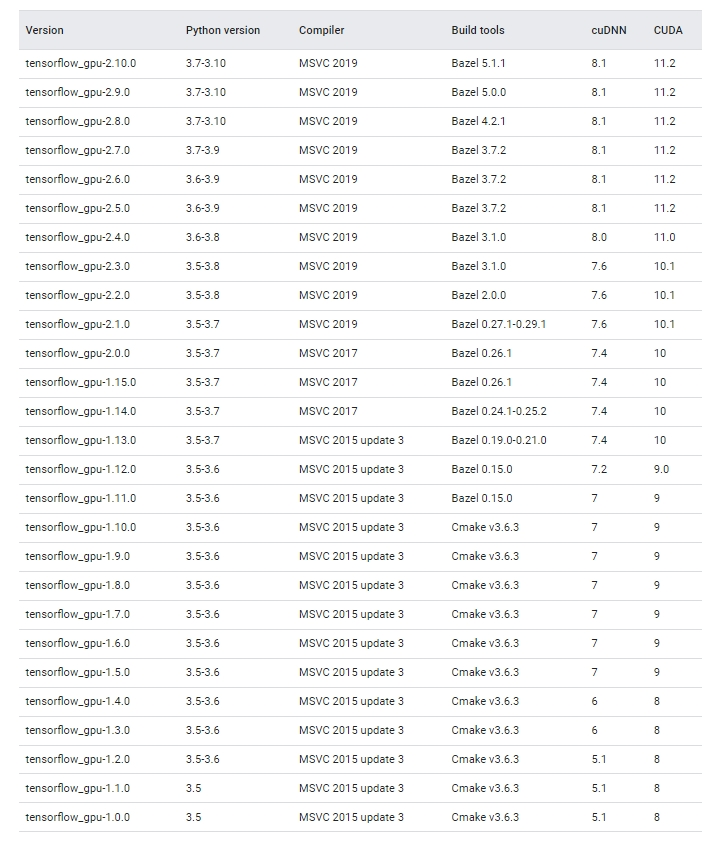
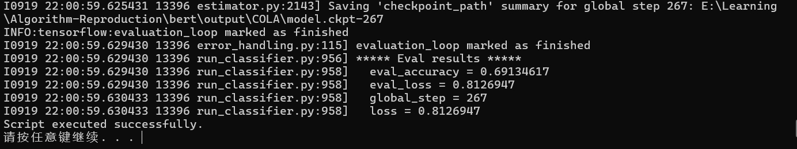
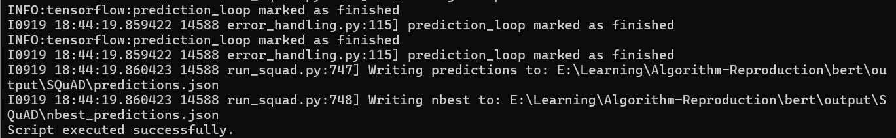
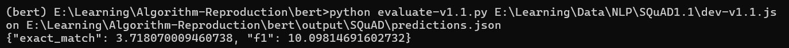
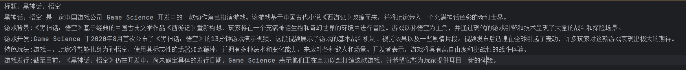
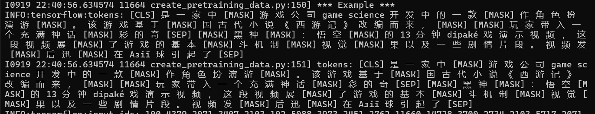
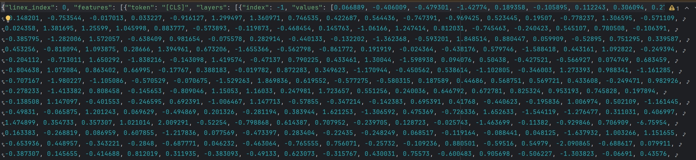
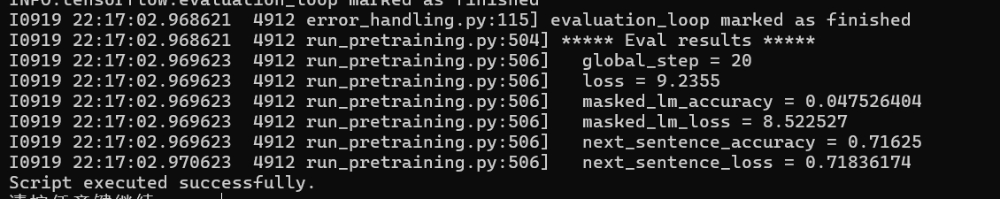

# BERT代码复现-基于tensorflow-gpu-2.10.0

本仓库的代码是基于Google发布的tensorflow1.x版本的改进版本，已经将全部的api转换为tensorflow2.x版本可兼容的api。以下的实验结果基于BERT-Base, Multilingual Cased，单个任务执行需要消耗14G左右的显存。

复现笔记：https://mp.weixin.qq.com/s/0yhLIBFosBHe7QYvcoNI7g?token=224962903&lang=zh_CN

# 设备条件及tensorflow对应的版本

```python
系统：Win11专业版
显卡：NVIDIA GeForce RTX 4060Ti 16G
CUDA：12.6
Python：3.10.12
Tensorflow-GPU：2.10.0
cudatoolkit：11.2.2 
cudnn：8.1.0.77 
```



# 环境创建

```python
conda create -n bert-tf python==3.10.12
conda activate bert-tf
```

```python
conda install conda-forge::cudatoolkit==11.2.2
conda install conda-forge::cudnn==8.1.0.77
```

```python
pip install tensorflow-gpu==2.10.0
pip install six==1.15.0
```

# 模型下载

- **[`BERT-Large, Uncased (Whole Word Masking)`](https://storage.googleapis.com/bert_models/2019_05_30/wwm_uncased_L-24_H-1024_A-16.zip)**: 24-layer, 1024-hidden, 16-heads, 340M parameters
- **[`BERT-Large, Cased (Whole Word Masking)`](https://storage.googleapis.com/bert_models/2019_05_30/wwm_cased_L-24_H-1024_A-16.zip)**: 24-layer, 1024-hidden, 16-heads, 340M parameters
- **[`BERT-Base, Uncased`](https://storage.googleapis.com/bert_models/2018_10_18/uncased_L-12_H-768_A-12.zip)**: 12-layer, 768-hidden, 12-heads, 110M parameters
- **[`BERT-Large, Uncased`](https://storage.googleapis.com/bert_models/2018_10_18/uncased_L-24_H-1024_A-16.zip)**: 24-layer, 1024-hidden, 16-heads, 340M parameters
- **[`BERT-Base, Cased`](https://storage.googleapis.com/bert_models/2018_10_18/cased_L-12_H-768_A-12.zip)**: 12-layer, 768-hidden, 12-heads , 110M parameters
- **[`BERT-Large, Cased`](https://storage.googleapis.com/bert_models/2018_10_18/cased_L-24_H-1024_A-16.zip)**: 24-layer, 1024-hidden, 16-heads, 340M parameters
- **[`BERT-Base, Multilingual Cased (New, recommended)`](https://storage.googleapis.com/bert_models/2018_11_23/multi_cased_L-12_H-768_A-12.zip)**: 104 languages, 12-layer, 768-hidden, 12-heads, 110M parameters
- **[`BERT-Base, Multilingual Uncased (Orig, not recommended)`](https://storage.googleapis.com/bert_models/2018_11_03/multilingual_L-12_H-768_A-12.zip) (Not recommended, use `Multilingual Cased` instead)**: 102 languages, 12-layer, 768-hidden, 12-heads, 110M parameters
- **[`BERT-Base, Chinese`](https://storage.googleapis.com/bert_models/2018_11_03/chinese_L-12_H-768_A-12.zip)**: Chinese Simplified and Traditional, 12-layer, 768-hidden, 12-heads, 110M parameters

# 数据下载

GLUE数据集：

```python
python download_glue_data.py
```

SQUAD（手动下载）：

|                          SQuAD 1.1                           |                          SQuAD 2.0                           |
| :----------------------------------------------------------: | :----------------------------------------------------------: |
| [train-v1.1.json](https://rajpurkar.github.io/SQuAD-explorer/dataset/train-v1.1.json) | [train-v2.0.json](https://rajpurkar.github.io/SQuAD-explorer/dataset/train-v2.0.json) |
| [dev-v1.1.json](https://rajpurkar.github.io/SQuAD-explorer/dataset/dev-v1.1.json) | [dev-v2.0.json](https://rajpurkar.github.io/SQuAD-explorer/dataset/dev-v2.0.json) |
| [evaluate-v1.1.py](https://github.com/allenai/bi-att-flow/blob/master/squad/evaluate-v1.1.py) | [evaluate-v2.0.py](https://worksheets.codalab.org/rest/bundles/0x6b567e1cf2e041ec80d7098f031c5c9e/contents/blob/) |

# 代码执行

```python
**open cmd**
./run/run_classifier.bat
./run/run_squad.bat
./run/create_pretraining_data.bat
./run/extract_features.bat
./run/run_pretraining.bat
```

# 预期结果

run_classifier.bat以COLA为例：



run_squad.bat以squad1.1为例：



squad需要执行独立的评估代码才能计算出相应的评估指标



创建预训练数据





文本特征提取



模型预训练

